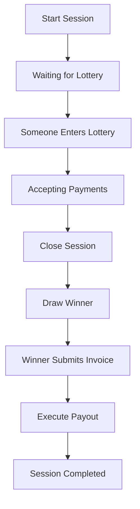

# Team Zaps - Developer Documentation 🛠️

> **Lightning payment coordination bot built with .NET 9**

This document provides technical information for developers who want to understand, modify, or contribute to Team Zaps.

## 🏗️ Architecture Overview

Team Zaps is a sophisticated Telegram bot that coordinates Lightning Network payments for group bill splitting. It's built using modern .NET practices with a clean, maintainable architecture.

### Key Features

- ✅ **Enterprise-Grade Architecture** - Built with .NET 9 Host Builder pattern
- ✅ **Dependency Injection** - Full DI container with proper service lifetimes  
- ✅ **Background Services** - Payment monitoring and bot lifecycle management
- ✅ **Lightning Integration** - LNbits API for invoice creation and payment processing
- ✅ **Session Management** - Concurrent session handling across multiple groups
- ✅ **Message Lifecycle** - Sophisticated message tracking and updates
- ✅ **Structured Logging** - Serilog with contextual logging throughout
- ✅ **Modern C#** - Nullable reference types, pattern matching, records
- ✅ **Payment Parser** - Advanced regex-based payment parsing with memo support

## 📁 Project Structure

```
src/
├── Configuration/                 # Configuration models and settings
│   ├── TelegramSettings.cs       # Bot token configuration
│   ├── LnbitsSettings.cs         # Lightning service configuration  
│   ├── BotBehaviorOptions.cs     # Runtime behavior settings
│   └── DebugSettings.cs          # Debug-only configuration (DEBUG builds)
├── Handlers/                     # Telegram update processing
│   ├── UpdateHandler.cs          # Main update router (partial class)
│   ├── UpdateHandler.DirectMessage.cs    # Private message handling
│   └── UpdateHandler.Session.cs          # Group session commands
├── Services/                     # Background and integration services
│   ├── TelegramBotService.cs     # Main bot service lifecycle
│   ├── PaymentMonitorService.cs  # Background payment monitoring
│   ├── RecoveryService.cs        # Lost sats recovery system
│   └── Backends/                 # Pluggable backend implementations
│       ├── Backend.cs            # Backend interfaces and base types
│       ├── Backend.AlbyHubService.cs   # AlbyHub NWC backend
│       ├── Backend.LnbitsService.cs    # LNBits REST API backend
│       └── Backend.CoinGecko.cs        # CoinGecko exchange rate backend
├── Sessions/                     # Core session management
│   ├── SessionManager.cs         # Session storage and lifecycle
│   ├── SessionState.cs           # Session and participant models
│   ├── SessionWorkflowService.cs # Session workflow logic
│   └── PaymentMonitorService.cs  # Background payment monitoring
├── Helper/                       # Specialized message builders
│   ├── MessageHelper.Status.cs   # Session status messages
│   ├── MessageHelper.Payment.cs  # Lightning invoice messages
│   ├── MessageHelper.Winner.cs   # Winner announcement messages
│   ├── MessageHelper.Summary.cs  # Payment summary messages
│   └── PaymentParser.cs          # Payment amount parsing logic
├── Utils.cs                      # Extension methods and utilities
├── Common.cs                     # Custom attributes and enums
├── GlobalUsings.cs              # Global using statements
└── Program.cs                   # Application entry point
```

## 🚀 Getting Started

### Prerequisites

```bash
# Required
.NET 9.0 SDK
Telegram Bot Token (from @BotFather)
LNbits instance (for Lightning payments)

# Optional but recommended
VS Code or Visual Studio
Git
```

### Setup Steps

1. **Clone and Build**
```bash
git clone <repository-url>
cd TeamZaps/src
dotnet restore
dotnet build
```

2. **Configure Services**

Create `appsettings.Development.json`:
```json
{
  "Telegram": {
    "BotToken": "YOUR_BOT_TOKEN_FROM_BOTFATHER",
    "RootUsers": [ 123456789 ]
  },
  "Lightning": {
    "LNBits": {
      "LndhubUrl": "YOUR_LNDHUB_URL_HERE",
      "ApiKey": "YOUR_API_KEY_HERE"
    },
    "AlbyHub": {
      "ConnectionString": "YOUR_NWC_CONNECTION_STRING_HERE",
      "RelayUrls": [ "YOUR_RELAY_URLS_HERE" ]
    }
  },
  "BotBehaviorOptions": {
    "AllowNonAdminSessionStart": false,
    "AllowNonAdminSessionClose": false, 
    "AllowNonAdminSessionCancel": false,
    "BudgetChoices": [50, 100, 150, 200, 250, 300],
    "MaxBudget": 10000.0
  },
  "Debug": {
    "FixBudget": 5.0
  }
}
```

3. **Run Development Server**
```bash
# Standard run
dotnet run

# Watch mode (auto-reload)
dotnet watch run

# With specific environment
ASPNETCORE_ENVIRONMENT=Development dotnet run
```

## 🔧 Configuration

### Lightning Backend

Team Zaps supports multiple Lightning backend implementations through a common `ILightningBackend` interface. **The first backend configured in the `Backends` section will be selected and used.**

#### AlbyHub Backend (NWC/NIP-47)

AlbyHub uses the **Nostr Wallet Connect (NWC)** protocol based on NIP-47 for communication over Nostr relays. This provides a decentralized approach to Lightning wallet integration.

```json
{
  "Backends": {
    "AlbyHub": {
      "ConnectionString": "nostr+walletconnect://PUBKEY?relay=wss://relay.getalby.com/v1&secret=SECRET",
      "RelayUrls": [ "wss://relay.getalby.com/v1" ]
    }
  }
}
```

**Configuration:**
- `ConnectionString` - NWC connection URI from AlbyHub wallet settings (format: `nostr+walletconnect://PUBKEY?relay=RELAY_URL&secret=SECRET`)
- `RelayUrls` - Specify relay URLs from connection string

**How to get the connection string:**
1. Open your AlbyHub wallet
2. Go to Connections → Create new connection
3. Select "Nostr Wallet Connect"
4. Copy the `nostr+walletconnect://...` URI

#### LNBits Backend (REST API)

LNBits uses a traditional REST API for Lightning operations. Requires a running LNbits instance.

```json
{
  "Backends": {
    "LNBits": {
      "LndhubUrl": "https://your-lnbits.com/lndhub/ext/",
      "ApiKey": "YOUR_LNBITS_API_KEY"
    }
  }
}
```

**Configuration:**
- `LndhubUrl` - LNDhub extension URL (must end with `/lndhub/ext/`)
- `ApiKey` - Invoice/read key from your LNbits wallet

#### CoinGecko Backend (Exchange Rates)

CoinGecko provides free BTC exchange rate data for fiat currency support.

```json
{
  "Backends": {
    "CoinGecko": { }
  }
}
```

**Configuration:**
- No settings required - works out of the box
- Automatically fetches fiat exchange rates
- Used by AlbyHub backend to support fiat currency invoices

#### ElectrumX Backend (Blockchain Data)

ElectrumX provides real-time Bitcoin blockchain data including current block height and timestamps. This is useful for monitoring network health and verifying transaction confirmations.

```json
{
  "Backends": {
    "ElectrumX": {
      "Host": "electrum.blockstream.info",
      "Port": 50001,
      "UseSsl": false,
      "TimeoutMs": 10000
    }
  }
}
```

**Configuration:**
- `Host` - ElectrumX server hostname
- `Port` - Server port (50001 for TCP, 50002 for SSL)
- `UseSsl` - Whether to use SSL/TLS connection
- `TimeoutMs` - Connection and request timeout in milliseconds

**Public ElectrumX Servers:**
- `electrum.blockstream.info:50001` (TCP) / `:50002` (SSL)
- `electrum.qtornado.com:50001` / `:50002`
- `bitcoin.aranguren.org:50001` / `:50002`

### Bot Behavior Options

The `BotBehaviorOptions` section controls various aspects of bot behavior:

#### MaxBudget
Controls the maximum total budget (in Euro) across all active sessions.
- **Default**: `disabled`

When the limit is reached, new users cannot join lotteries until existing sessions complete or are cancelled.

```json
{
  "BotBehaviorOptions": {
    "MaxBudget": 5000.0
  }
}
```

#### MaxParallelSessions
Controls the maximum number of concurrent sessions allowed server-wide.
- **Default**: `disabled` (unlimited sessions)

When the limit is reached, new sessions cannot be started until existing sessions complete or are cancelled. This maybe helps manage server load and resource usage, but also to preserve the lightning backend.

```json
{
  "BotBehaviorOptions": {
    "MaxParallelSessions": 10
  }
}
```

### EnableRecovery

Disables the lost sats recovery system during development.
- **Default**: `enabled`

Completely disables all recovery operations:
- No lost sats records will be created
- Existing recovery files will not be processed
- Background scanning for lost sats will be skipped

```json
{
  "Debug": {
    "DisableRecovery": true
  }
}
```

**Use cases:**
- Testing payment flows without recovery interference
- Preventing recovery file creation during development
- Debugging session lifecycle without recovery noise

## 🧠 Core Concepts

### Session Lifecycle



### Payment Flow

1. **User Input** - Natural language parsing (`"5.99 Beer"`)
2. **Token Generation** - Structured `PaymentToken` objects with amounts and memos
3. **Invoice Creation** - LNbits API calls to generate Lightning invoices
4. **Payment Monitoring** - Background service polls payment status
5. **Confirmation** - UI updates and session state changes

### Lost and Found Recovery System

Team Zaps includes a comprehensive **Lost and Found** recovery system to protect users from losing sats due to interrupted sessions, network issues, or other failures.

#### How It Works

**Automatic Detection:**
- When sessions fail or are cancelled unexpectedly, user payments are automatically recorded as "lost sats"
- Background service scans for lost payments periodically
- Recovery records are stored as JSON files in the `data/lostSats/` directory

**User Notification:**
- Users with lost sats receive automatic notifications via direct message
- Notifications include recovery amount and instructions
- Notifications are sent weekly until recovery is completed

### Message Management

Team Zaps employs sophisticated message lifecycle management:

- **Status Messages** - Pinned group messages showing session state
- **User Messages** - Private messages with personal status and controls
- **Payment Messages** - Lightning invoice messages with QR codes
- **Winner Messages** - Lottery result announcements
- **Summary Messages** - Complete payment breakdowns for winners

## 🔧 Key Services

### Backend Architecture

Team Zaps uses a **pluggable backend architecture** that allows different service providers to be swapped without changing application code. Backends implement feature-specific interfaces and are automatically discovered via attributes.

#### Backend Interface Pattern

All backends must:
1. **Implement one or more backend interfaces** based on provided features:
   - `ILightningBackend` - Lightning wallet operations (create/pay invoices, check status)
   - `IExchangeRateBackend` - Cryptocurrency exchange rate lookups

2. **Decorate the class** with `[BackendDescription("BackendName")]` attribute:
   ```csharp
   [BackendDescription("AlbyHub")]
   public class AlbyHubService : ILightningBackend
   {
       // Implementation...
   }
   ```

#### Available Backends

**Lightning Backends:**
- **AlbyHub** - NWC (Nostr Wallet Connect) using NIP-47 protocol
  - Implements: `ILightningBackend`
  - Configuration: `Backends:AlbyHub` section
  - Features: Invoice creation, payment, status checks via Nostr relays

- **LNBits** - Traditional REST API integration
  - Implements: `ILightningBackend`
  - Configuration: `Backends:LNBits` section  
  - Features: Full Lightning operations with fiat currency support

**Exchange Rate Backends:**
- **CoinGecko** - Free cryptocurrency price data
  - Implements: `IExchangeRateBackend`
  - Configuration: `Backends:CoinGecko` section (empty config - no keys needed)
  - API: CoinGecko public API (no authentication required)
  - Features: BTC/USD and BTC/EUR rates with 5-minute caching
  - Rate limits: 30 calls/minute on free tier

**Blockchain Data Backends:**
- **ElectrumX** - Bitcoin blockchain information via ElectrumX protocol
  - Implements: `IBackend` (can be extended for specific interfaces)
  - Configuration: `Backends:ElectrumX` section
  - Protocol: JSON-RPC 2.0 over TCP
  - Features: Current block height/time, block headers, server info
  - Note: NBitcoin does NOT include ElectrumX support - this is a custom implementation

#### Backend Selection

Backends are automatically registered based on configuration:
```json
{
  "Lightning": {
    "AlbyHub": { /* config */ },  // ← First backend is selected
    "LNBits": { /* config */ }
  }
}
```

The first configured backend in each category is automatically selected and injected into services.

#### Adding New Backends

To add a new backend:

1. Create `Backend.YourService.cs` in `Services/Backends/`
2. Implement required interface(s) (`ILightningBackend`, `IExchangeRateBackend`, etc.)
3. Add `[BackendDescription("YourService")]` attribute

**Example - Multi-Feature Backend:**
```csharp
[BackendDescription("SuperWallet")]
public class SuperWalletService : ILightningBackend, IExchangeRateBackend
{
    // Implements both Lightning operations AND exchange rates
}
```

### SessionManager
```csharp
// Central session storage and participant management
var session = sessionManager.GetSessionByChat(chatId);
var participant = sessionManager.GetOrAddParticipant(session, userId, displayName);
```

### PaymentMonitorService
```csharp
// Background service checking payment status every 5 seconds
// Automatically updates UI when payments are confirmed
// Handles cleanup of help messages and status updates
```

### RecoveryService
```csharp
// Background service for lost sats recovery
// - Runs periodic scans every 6 hours
// - Notifies users about pending recoveries
// - Manages recovery file storage in data/lostSats/ directory
// - Registered as both Singleton and HostedService
public class RecoveryService : BackgroundService
{
    // Record lost sats for interrupted payments
    public async Task RecordLostSatsAsync(ParticipantState participant, string reason);
    
    // Clear recovery record after successful recovery
    public Task ClearLostSatsAsync(long userId);
    
    // Get user's lost sats record
    public Task<LostSatsRecord?> TryGetLostSatsAsync(long userId);
    
    // Get all pending recoveries (for diagnostics)
    public Task<ICollection<LostSatsRecord>> GetAllLostSatsAsync();
    
    // Scan for lost sats and notify users
    public async Task ScanForLostSatsAsync();
}
```

### Lightning Backend (ILightningBackend)
```csharp
// Abstracted Lightning Network integration
// Automatically uses the first configured backend (AlbyHub or LNBits)
var invoice = await lightningBackend.CreateInvoiceAsync(amount, "EUR", memo);
var status = await lightningBackend.CheckPaymentStatusAsync(paymentHash);
var result = await lightningBackend.PayInvoiceAsync(bolt11Invoice);
```

**Available Backends:**
- **AlbyHub** - Uses NWC (Nostr Wallet Connect) with NIP-47 protocol over Nostr relays
- **LNBits** - Uses REST API for LNbits instances

### PaymentParser
```csharp
// Advanced payment string parsing with regex
if (PaymentParser.TryParse("5.99 beer + 2.50 pizza", out var tokens, out var error))
{
    // tokens contain structured PaymentToken objects
    // Supports: amounts, currencies, memos, multiple formats
}
```

## 🧪 Development Workflow

### Adding New Features

1. **Plan the User Experience** - How should users interact with your feature?
2. **Design the Data Model** - What state needs to be tracked? 
3. **Implement Message Handlers** - How does Telegram input get processed?
4. **Build Message Builders** - How is information presented to users?
5. **Add Background Processing** - What happens asynchronously?
6. **Write Tests** - Ensure reliability and prevent regressions

### Code Style Guidelines

```csharp
// ✅ Good: Use expression-bodied members
public bool HasPayments => !Payments.IsEmpty();

// ✅ Good: Use pattern matching 
var status = phase switch
{
    SessionPhase.AcceptingPayments => "Ready for payments",
    SessionPhase.Completed => "Session finished",
    _ => "Unknown status"
};

// ✅ Good: Use nullable reference types
public string? WinnerInvoiceBolt11 { get; set; }

// ✅ Good: Use StringBuilder for complex message building
var message = new StringBuilder();
message.AppendLine("🎯 Session Status");
message.AppendLine($"Phase: *{session.Phase}*");
return message.ToString();

// ✅ Good: Use 'is null' patterns consistently
if (participant.StatusMessageId is null)
    return;
```

### Message Helper Patterns

```csharp
internal static class YourMessageHelper
{
    public static async Task<Message> SendAsync(...) 
    {
        // Create and send new message
        // Store message ID in session state
        // Return message for further processing
    }
    
    public static async Task UpdateAsync(...) 
    {
        // Edit existing message
        // Handle deletion/recreation if needed
        // Graceful error handling with logging
    }
    
    private static string Build(...) 
    {
        // Use StringBuilder for message construction  
        // Keep all UI text generation here
        // Support different states/contexts
    }
}
```

## 🔍 Debugging & Troubleshooting

### Debug Configuration

The `DebugSettings` class provides development-time configuration options that are only available in DEBUG builds:

```csharp
// Configuration/DebugSettings.cs
public class DebugSettings
{
    public const string SectionName = "Debug";

#if DEBUG
    /// <summary>
    /// Pre-configured budget for users when joining the lottery.
    /// </summary>
    public double? FixBudget { get; set; }
#endif
}
```

All debug settings will apply when set in `appsettings.Development.json`.

#### Debug.FixBudget

This automatically assigns a default budget to users joining the lottery, bypassing the budget selection UI:

```json
{
  "Debug": {
    "FixBudget": 5.0  // Users get 100€ budget automatically
  }
}
```

### Common Issues

**Bot doesn't respond:**
```bash
# Check logs for errors
dotnet run
# Look for "Bot initialized successfully" message
# Verify bot token in appsettings
```

**Payment monitoring not working:**
```bash
# Verify LNbits configuration
# Check LNbits API connectivity  
# Monitor PaymentMonitorService logs
```

**Message updates failing:**
```bash
# Check for "message to edit not found" errors
# Verify message IDs are stored correctly
# Look for Telegram API rate limiting
```

### Logging Configuration

```json
{
  "Serilog": {
    "MinimumLevel": {
      "Default": "Information",
      "Override": {
        "Microsoft": "Warning",
        "System": "Warning",
        "teamZaps.Sessions.PaymentMonitorService": "Debug"
      }
    }
  }
}
```

### Performance Monitoring

- Session count: `sessionManager.ActiveSessions.Count`
- Payment monitoring: Check logs for polling frequency
- Memory usage: Monitor `ConcurrentDictionary` sizes
- API calls: Track LNbits request/response times

## 🧪 Testing

### Unit Testing Structure
```bash
# Recommended test structure (not yet implemented)
tests/
├── Unit/
│   ├── PaymentParserTests.cs
│   ├── SessionManagerTests.cs  
│   └── MessageHelperTests.cs
├── Integration/
│   ├── LnbitsServiceTests.cs
│   └── TelegramBotTests.cs
└── TestHelpers/
    ├── MockTelegramBot.cs
    └── TestSessionFactory.cs
```

### Manual Testing Checklist

- [ ] Start session in group chat
- [ ] Join session from multiple users
- [ ] Enter lottery and verify payment unlock
- [ ] Send various payment formats
- [ ] Pay Lightning invoices and verify confirmation
- [ ] Close session and verify winner selection
- [ ] Submit winner invoice and verify payout
- [ ] Test error scenarios (invalid amounts, network issues)
- [ ] Verify message updates and cleanup

## 🚀 Deployment

### Production Configuration

```json
{
  "Serilog": {
    "MinimumLevel": {
      "Default": "Warning",
      "Override": {
        "teamZaps": "Information"
      }
    }
  },
  "BotBehaviorOptions": {
    "AllowNonAdminSessionStart": false,
    "AllowNonAdminSessionClose": false,
    "AllowNonAdminSessionCancel": false
  }
}
```

### Environment Variables
```bash
# Required
export Telegram__BotToken="production-token"
export Lnbits__LndhubUrl="https://your-lnbits.com/lndhub/ext/"
export Lnbits__ApiKey="production-api-key"

# Optional
export ASPNETCORE_ENVIRONMENT="Production"
export BotBehaviorOptions__AllowNonAdminSessionStart="false"
```

### Docker Deployment (Recommended)

The repository includes a production-ready `docker-compose.yml` and `Dockerfile`.

**To deploy on a server:**

1. Copy `docker-compose.yml` and `.env.example` to your server.
   ```bash
   wget https://raw.githubusercontent.com/SatMeNow/teamZaps/refs/heads/master/docker-compose.yml
   wget https://raw.githubusercontent.com/SatMeNow/teamZaps/refs/heads/master/.env.example
   ```
2. Rename `.env.example` to `.env` and fill in your secrets (Bot Token, NWC connection string, etc.).
   ```bash
   mv .env.example .env
   ```
3. Customize by changing environment variables in `.env` to suit your own needs.
4. Create the required `appsettings.json` file and `data` directory:
   ```bash
   # Create data directory for logs/persistence
   mkdir -p /app/data

   # Create an empty appsettings.json (required for volume mount)
   # Note: You can also copy src/appsettings.json from the repo for a full template
   echo "{}" > /app/appsettings.json
   ```
5. Run:
   ```bash
   docker compose up -d
   ```

This will pull the latest pre-built image from **GitHub Container Registry** (`ghcr.io/satmenow/teamzaps`) and start the bot.

**Manual Build:**
If you prefer to build the image locally:
```bash
docker build -t teamzaps .
```

## 🔄 CI/CD & Versioning

The project uses GitHub Actions for Continuous Integration and Deployment.

### Automated Pipeline
The pipeline (`.github/workflows/deploy.yml`) automatically runs on:
- Pushes to `master`
- Pull Requests to `master`
- Tag pushes (`v*`)

**It performs the following steps:**
1. **Build & Test**: Compiles the code and runs tests (if any).
2. **Auto-Tagging**: Calculates the next semantic version based on commit messages.
3. **Docker Build**: Builds a multi-stage Docker image with the new version tag.
4. **Publish**: Pushes the image to GitHub Container Registry (GHCR).
5. **Release**: Creates a GitHub Release with binaries and changelog.

### Controlling Version Bumps
The versioning system follows [Semantic Versioning](https://semver.org/). You can control the version bump by including specific keywords in your **commit messages** or **PR titles**:

| Keyword | Effect | Example |
|---------|--------|---------|
| `#major` | Major version bump (X.0.0) | `feat: rewrite core engine #major` |
| `#minor` | Minor version bump (0.X.0) | `feat: add new payment method #minor` |
| (none) | Patch version bump (0.0.X) | `fix: typo in readme` |

*Default behavior is a **Patch** bump if no keyword is found.*

### Beta & RC Builds
You can create pre-release builds (e.g., `v1.0.1-beta.0`) from the `nextMaster` branch without affecting the stable `master` branch.

1. Go to **GitHub Actions** -> **Build and Deploy**.
2. Click **Run workflow**.
3. Select Branch: `nextMaster`.
4. Select Release Type: `beta` or `rc`.

This will:
- Create a pre-release tag (e.g., `v1.0.1-beta.0`).
- Build and push a Docker image with that tag.
- Create a GitHub "Pre-release" with artifacts.

### Manual Dev & Debug Builds
Manual workflow dispatches can be started from *any* branch. When you run the workflow, pick the branch you need and choose the release type:

1. Go to **GitHub Actions** -> **Build and Deploy**.
2. Click **Run workflow**.
3. Select your branch.
4. Select Release Type: `debug`.

The pipeline builds a Debug-mode Docker image, publishes it to GHCR, and skips pushing git tags/releases (the workflow runs `dry_run` during the tagging step).

The pipeline still calculates the semantic version for you, and the Docker build picks up the resolved version via `/p:Version` so `/diag` and other diagnostics show the same version that shipped. Debug builds produce Docker images tagged both `debug` and `v<version>-debug.<run>` (e.g., `v0.0.2-debug.123`), making it easy to identify the exact debug build.

### Available Docker Tags

The following tags are published to GHCR (`ghcr.io/satmenow/teamzaps`):

| Tag Pattern | Source | Description |
|-------------|--------|-------------|
| `latest` | `master` branch | Stable production releases |
| `v1.2.3` | `master` branch | Specific stable version (semver) |
| `v1.2` | `master` branch | Major.minor version tag |
| `beta` | `nextMaster` manual | Latest beta pre-release |
| `v1.2.3-beta.0` | `nextMaster` manual | Specific beta version |
| `rc` | `nextMaster` manual | Latest release candidate |
| `v1.2.3-rc.0` | `nextMaster` manual | Specific RC version |
| `debug` | Any branch manual | Latest debug build |
| `v1.2.3-debug.123` | Any branch manual | Specific debug build with run number |
| `sha-<hash>` | Any build | Git commit-specific image |

**To use a specific tag in docker-compose:**
```bash
# In .env file:
DOCKER_TAG=beta
# or
DOCKER_TAG=v1.2.3-debug.123
```

### Automatic Updates with Watchtower

The `docker-compose.yml` includes Watchtower, which automatically pulls and deploys new images when they're published to GHCR.

**Default behavior:**
- Polls GHCR every 30 minutes for image updates
- Only updates containers with the `com.centurylinklabs.watchtower.enable=true` label
- Automatically cleans up old images

**To disable auto-updates:**
Remove or comment out the `watchtower` service in `docker-compose.yml`.

**To change update frequency:**
Adjust `WATCHTOWER_POLL_INTERVAL` (in seconds) in the watchtower service environment variables.

## ✅ User-facing Commands (quick reference)

Use the commands below in the appropriate context — group chats or private/direct messages with the bot.

> Explained commands in this section are only relevant for technical users!
  For end-user guidance (screenshots and UX tips) see the user-facing README in the project root: [README.MD](../README.MD)

### Group commands (use inside the group chat)

### Private commands (use in a direct/private chat with the bot)
- `/diag` - Show diagnostics (root users only)

  This command returns detailed runtime diagnostics   intended for the bot operator (root user) only. It   includes:
  - Current host environment and process information
  - Active sessions and their phases
  - Recovery queue status and lost sats summary
  - Registered backends and their health status
  
  Only root user IDs (configured in `appsettings.*.json` under `Telegram:RootUsers`) can run `/diag`. The   output may contain sensitive operational details — do   not share publicly.

## 🤝 Contributing

You will find the [repository](https://github.com/SatMeNow/teamZaps) on github.

### Pull Request Process

1. **Fork & Branch** - Create feature branches from `master`
2. **Follow Patterns** - Match existing code style and architecture
3. **Test Thoroughly** - Manual testing at minimum, unit tests preferred  
4. **Update Documentation** - Keep this README current
5. **Small Changes** - Prefer small, focused PRs over large refactors

### Areas for Contribution

- 🧪 **Unit Tests** - Critical for reliability
- 📊 **Metrics & Monitoring** - Performance insights
- 🌐 **Internationalization** - Multi-language support  
- 🔒 **Security Hardening** - Rate limiting, input validation
- 📱 **UI Improvements** - Better inline keyboards and messages
- ⚡ **Lightning Features** - Additional payment methods, routing

## 📚 Resources

### External APIs & Documentation
- [Telegram Bot API](https://core.telegram.org/bots/api)
- [Telegram.Bot Library](https://github.com/TelegramBots/Telegram.Bot)
- [LNbits API Documentation](https://lnbits.org/)
- [Lightning Network Specifications](https://github.com/lightningnetwork/lightning-rfc)

### .NET Resources
- [.NET 9 Documentation](https://docs.microsoft.com/dotnet/)
- [Dependency Injection in .NET](https://docs.microsoft.com/aspnet/core/fundamentals/dependency-injection)
- [Serilog Documentation](https://serilog.net/)
- [Background Services in .NET](https://docs.microsoft.com/aspnet/core/fundamentals/host/hosted-services)

---

**Happy coding!** 🚀⚡
