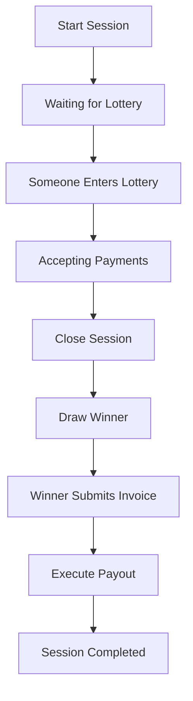

# Team Zaps - Developer Documentation 🛠️

> **Lightning payment coordination bot built with .NET 9**

This document provides technical information for developers who want to understand, modify, or contribute to Team Zaps.

## 🏗️ Architecture Overview

Team Zaps is a sophisticated Telegram bot that coordinates Lightning Network payments for group bill splitting. It's built using modern .NET practices with a clean, maintainable architecture.

### Key Features

- ✅ **Enterprise-Grade Architecture** - Built with .NET 9 Host Builder pattern
- ✅ **Dependency Injection** - Full DI container with proper service lifetimes  
- ✅ **Background Services** - Payment monitoring and bot lifecycle management
- ✅ **Lightning Integration** - LNbits API for invoice creation and payment processing
- ✅ **Session Management** - Concurrent session handling across multiple groups
- ✅ **Message Lifecycle** - Sophisticated message tracking and updates
- ✅ **Structured Logging** - Serilog with contextual logging throughout
- ✅ **Modern C#** - Nullable reference types, pattern matching, records
- ✅ **Payment Parser** - Advanced regex-based payment parsing with memo support

## 📁 Project Structure

```
src/
├── Configuration/                 # Configuration models and settings
│   ├── TelegramSettings.cs       # Bot token configuration
│   ├── LnbitsSettings.cs         # Lightning service configuration  
│   └── BotBehaviorOptions.cs     # Runtime behavior settings
├── Handlers/                     # Telegram update processing
│   ├── UpdateHandler.cs          # Main update router (partial class)
│   ├── UpdateHandler.DirectMessage.cs    # Private message handling
│   └── UpdateHandler.Session.cs          # Group session commands
├── Services/                     # Background and integration services
│   ├── TelegramBotService.cs     # Main bot service lifecycle
│   └── LnbitsService.cs          # Lightning Network integration
├── Sessions/                     # Core session management
│   ├── SessionManager.cs         # Session storage and lifecycle
│   ├── SessionState.cs           # Session and participant models
│   ├── SessionWorkflowService.cs # Session workflow logic
│   └── PaymentMonitorService.cs  # Background payment monitoring
├── Helper/                       # Specialized message builders
│   ├── MessageHelper.Status.cs   # Session status messages
│   ├── MessageHelper.Payment.cs  # Lightning invoice messages
│   ├── MessageHelper.Winner.cs   # Winner announcement messages
│   ├── MessageHelper.Summary.cs  # Payment summary messages
│   └── PaymentParser.cs          # Payment amount parsing logic
├── Utils.cs                      # Extension methods and utilities
├── Common.cs                     # Custom attributes and enums
├── GlobalUsings.cs              # Global using statements
└── Program.cs                   # Application entry point
```

## 🚀 Getting Started

### Prerequisites

```bash
# Required
.NET 9.0 SDK
Telegram Bot Token (from @BotFather)
LNbits instance (for Lightning payments)

# Optional but recommended
VS Code or Visual Studio
Git
```

### Setup Steps

1. **Clone and Build**
```bash
git clone <repository-url>
cd TeamZaps/src
dotnet restore
dotnet build
```

2. **Configure Services**

Create `appsettings.Development.json`:
```json
{
  "Telegram": {
    "BotToken": "YOUR_BOT_TOKEN_FROM_BOTFATHER"
  },
  "Lnbits": {
    "LndhubUrl": "https://your-lnbits.com/lndhub/ext/",
    "ApiKey": "YOUR_LNBITS_API_KEY"
  },
  "BotBehaviorOptions": {
    "AllowNonAdminSessionStart": false,
    "AllowNonAdminSessionClose": false, 
    "AllowNonAdminSessionCancel": false
  }
}
```

3. **Run Development Server**
```bash
# Standard run
dotnet run

# Watch mode (auto-reload)
dotnet watch run

# With specific environment
ASPNETCORE_ENVIRONMENT=Development dotnet run
```

## 🧠 Core Concepts

### Session Lifecycle



### Payment Flow

1. **User Input** - Natural language parsing (`"5.99 beer + 2.50 tip"`)
2. **Token Generation** - Structured `PaymentToken` objects with amounts and memos
3. **Invoice Creation** - LNbits API calls to generate Lightning invoices
4. **Payment Monitoring** - Background service polls payment status
5. **Confirmation** - UI updates and session state changes

### Message Management

Team Zaps employs sophisticated message lifecycle management:

- **Status Messages** - Pinned group messages showing session state
- **User Messages** - Private messages with personal status and controls
- **Payment Messages** - Lightning invoice messages with QR codes
- **Winner Messages** - Lottery result announcements
- **Summary Messages** - Complete payment breakdowns for winners

## 🔧 Key Services

### SessionManager
```csharp
// Central session storage and participant management
var session = sessionManager.GetSessionByChat(chatId);
var participant = sessionManager.GetOrAddParticipant(session, userId, displayName);
```

### PaymentMonitorService
```csharp
// Background service checking payment status every 5 seconds
// Automatically updates UI when payments are confirmed
// Handles cleanup of help messages and status updates
```

### LnbitsService  
```csharp
// Lightning Network integration
var invoice = await lnbitsService.CreateInvoiceAsync(amount, "EUR", memo);
var status = await lnbitsService.CheckPaymentStatusAsync(paymentHash);
var result = await lnbitsService.PayInvoiceAsync(bolt11Invoice);
```

### PaymentParser
```csharp
// Advanced payment string parsing with regex
if (PaymentParser.TryParse("5.99 beer + 2.50 tip", out var tokens, out var error))
{
    // tokens contain structured PaymentToken objects
    // Supports: amounts, currencies, memos, multiple formats
}
```

## 🧪 Development Workflow

### Adding New Features

1. **Plan the User Experience** - How should users interact with your feature?
2. **Design the Data Model** - What state needs to be tracked? 
3. **Implement Message Handlers** - How does Telegram input get processed?
4. **Build Message Builders** - How is information presented to users?
5. **Add Background Processing** - What happens asynchronously?
6. **Write Tests** - Ensure reliability and prevent regressions

### Code Style Guidelines

```csharp
// ✅ Good: Use expression-bodied members
public bool HasPayments => !Payments.IsEmpty();

// ✅ Good: Use pattern matching 
var status = phase switch
{
    SessionPhase.AcceptingPayments => "Ready for payments",
    SessionPhase.Completed => "Session finished",
    _ => "Unknown status"
};

// ✅ Good: Use nullable reference types
public string? WinnerInvoiceBolt11 { get; set; }

// ✅ Good: Use StringBuilder for complex message building
var message = new StringBuilder();
message.AppendLine("🎯 Session Status");
message.AppendLine($"Phase: *{session.Phase}*");
return message.ToString();

// ✅ Good: Use 'is null' patterns consistently
if (participant.StatusMessageId is null)
    return;
```

### Message Helper Patterns

```csharp
internal static class YourMessageHelper
{
    public static async Task<Message> SendAsync(...) 
    {
        // Create and send new message
        // Store message ID in session state
        // Return message for further processing
    }
    
    public static async Task UpdateAsync(...) 
    {
        // Edit existing message
        // Handle deletion/recreation if needed
        // Graceful error handling with logging
    }
    
    private static string Build(...) 
    {
        // Use StringBuilder for message construction  
        // Keep all UI text generation here
        // Support different states/contexts
    }
}
```

## 🔍 Debugging & Troubleshooting

### Common Issues

**Bot doesn't respond:**
```bash
# Check logs for errors
dotnet run
# Look for "Bot initialized successfully" message
# Verify bot token in appsettings
```

**Payment monitoring not working:**
```bash
# Verify LNbits configuration
# Check LNbits API connectivity  
# Monitor PaymentMonitorService logs
```

**Message updates failing:**
```bash
# Check for "message to edit not found" errors
# Verify message IDs are stored correctly
# Look for Telegram API rate limiting
```

### Logging Configuration

```json
{
  "Serilog": {
    "MinimumLevel": {
      "Default": "Information",
      "Override": {
        "Microsoft": "Warning",
        "System": "Warning",
        "teamZaps.Sessions.PaymentMonitorService": "Debug"
      }
    }
  }
}
```

### Performance Monitoring

- Session count: `sessionManager.ActiveSessions.Count`
- Payment monitoring: Check logs for polling frequency
- Memory usage: Monitor `ConcurrentDictionary` sizes
- API calls: Track LNbits request/response times

## 🧪 Testing

### Unit Testing Structure
```bash
# Recommended test structure (not yet implemented)
tests/
├── Unit/
│   ├── PaymentParserTests.cs
│   ├── SessionManagerTests.cs  
│   └── MessageHelperTests.cs
├── Integration/
│   ├── LnbitsServiceTests.cs
│   └── TelegramBotTests.cs
└── TestHelpers/
    ├── MockTelegramBot.cs
    └── TestSessionFactory.cs
```

### Manual Testing Checklist

- [ ] Start session in group chat
- [ ] Join session from multiple users
- [ ] Enter lottery and verify payment unlock
- [ ] Send various payment formats
- [ ] Pay Lightning invoices and verify confirmation
- [ ] Close session and verify winner selection
- [ ] Submit winner invoice and verify payout
- [ ] Test error scenarios (invalid amounts, network issues)
- [ ] Verify message updates and cleanup

## 🚀 Deployment

### Production Configuration

```json
{
  "Serilog": {
    "MinimumLevel": {
      "Default": "Warning",
      "Override": {
        "teamZaps": "Information"
      }
    }
  },
  "BotBehaviorOptions": {
    "AllowNonAdminSessionStart": false,
    "AllowNonAdminSessionClose": false,
    "AllowNonAdminSessionCancel": false
  }
}
```

### Environment Variables
```bash
# Required
export Telegram__BotToken="production-token"
export Lnbits__LndhubUrl="https://your-lnbits.com/lndhub/ext/"
export Lnbits__ApiKey="production-api-key"

# Optional
export ASPNETCORE_ENVIRONMENT="Production"
export BotBehaviorOptions__AllowNonAdminSessionStart="false"
```

### Docker Support
```dockerfile
# Dockerfile (create if needed)
FROM mcr.microsoft.com/dotnet/aspnet:9.0
WORKDIR /app
COPY publish/ .
ENTRYPOINT ["dotnet", "teamZaps.dll"]
```

## 🤝 Contributing

### Pull Request Process

1. **Fork & Branch** - Create feature branches from `main`
2. **Follow Patterns** - Match existing code style and architecture
3. **Test Thoroughly** - Manual testing at minimum, unit tests preferred  
4. **Update Documentation** - Keep this README current
5. **Small Changes** - Prefer small, focused PRs over large refactors

### Areas for Contribution

- 🧪 **Unit Tests** - Critical for reliability
- 📊 **Metrics & Monitoring** - Performance insights
- 🌐 **Internationalization** - Multi-language support  
- 🔒 **Security Hardening** - Rate limiting, input validation
- 📱 **UI Improvements** - Better inline keyboards and messages
- ⚡ **Lightning Features** - Additional payment methods, routing

## 📚 Resources

### External APIs & Documentation
- [Telegram Bot API](https://core.telegram.org/bots/api)
- [Telegram.Bot Library](https://github.com/TelegramBots/Telegram.Bot)
- [LNbits API Documentation](https://lnbits.org/)
- [Lightning Network Specifications](https://github.com/lightningnetwork/lightning-rfc)

### .NET Resources
- [.NET 9 Documentation](https://docs.microsoft.com/dotnet/)
- [Dependency Injection in .NET](https://docs.microsoft.com/aspnet/core/fundamentals/dependency-injection)
- [Serilog Documentation](https://serilog.net/)
- [Background Services in .NET](https://docs.microsoft.com/aspnet/core/fundamentals/host/hosted-services)

---

**Happy coding!** 🚀⚡
